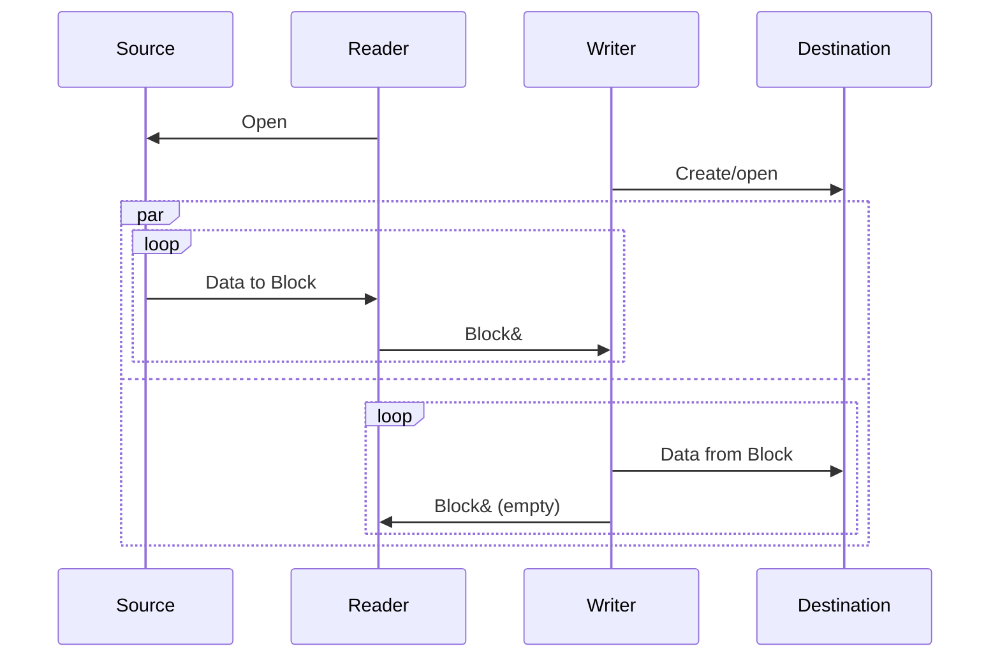
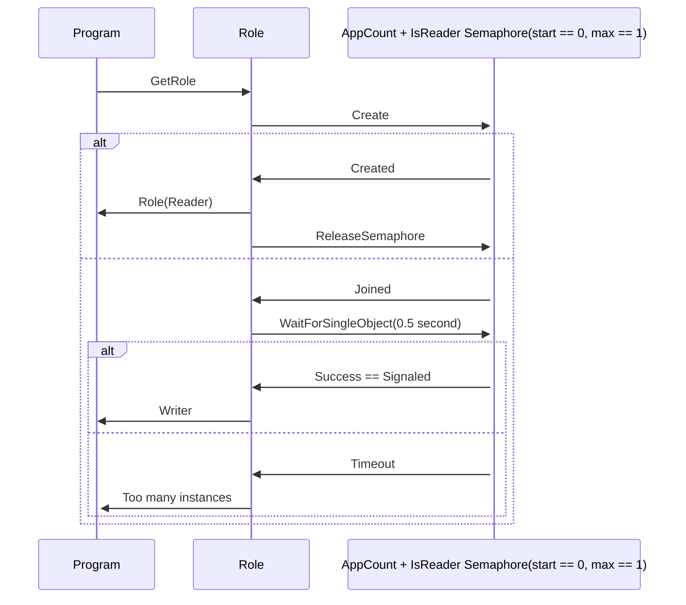
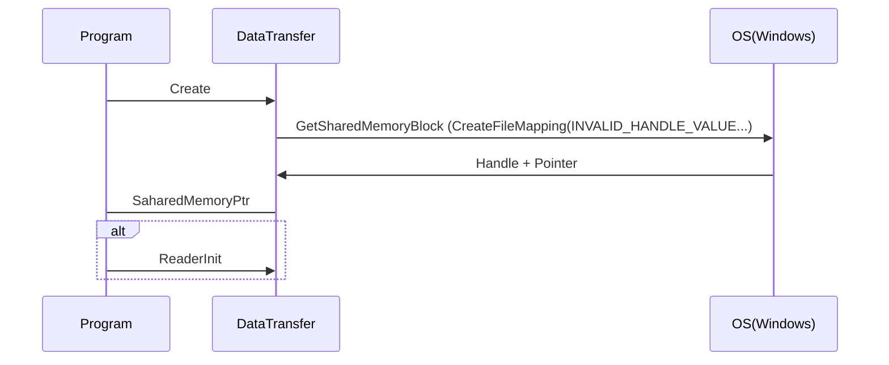
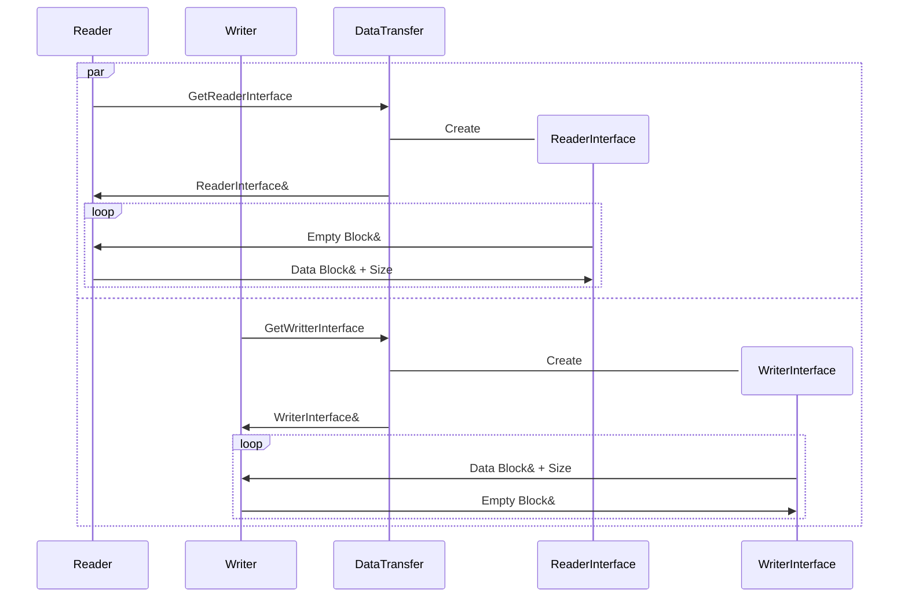
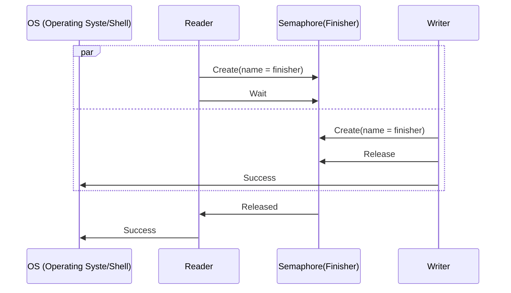
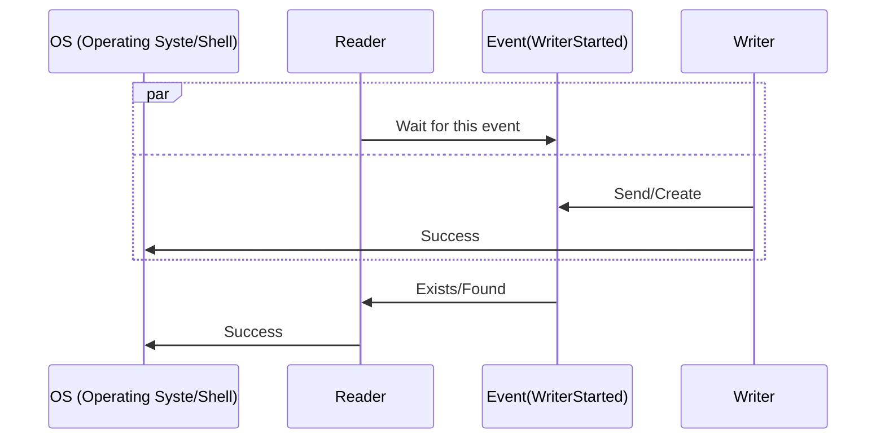

# Multiprocess communication

Let's use one semaphore for both: Decidnig role and synchronizing shared memory creation.
Let's prefer our API to not contein OS dependent object (like semaphore)

## High level Inter-process communication

Notes:
Reader owns all blocks at this diagram start.

Reader and writter are decided and sychronized by semaphores. It's shown on later diagrams.

## Decide process role

## Create shared memory object

## Do copy

## Final handshake

Writer part is done before writting file, reader part is done after reading whole file.
It's important for files smaller than shared memory block, where reader can have its work
done before writter starts.

Without this handshake reader might finish before second process starts deciding it's role.
And therefore it would find it's the first/only process and become reader again.

## Not used version of the final handshake

Start condition: Reader is done readng source file.
(Posible optimizazion: when more than BLOCK_NUM time it's sure writter exists as it returned at least one block)

<https://learn.microsoft.com/en-us/windows/win32/api/synchapi/nf-synchapi-createeventa>
Says: Use the CloseHandle function to close the handle. The system closes the handle automatically when the process terminates. The event object is destroyed when its last handle has been closed.

This handshake is needed for example for small files.
We need to prevent the situation when Reader is finished before writter is even started. Without this handshake both processes would become readers.

What is the problem here? When event is not consumed by reader until writer ends, event is disposed and reader wits indefinitely.

Solution: Use somethning created by reader:
1) New semaphore created by reader. And wait for it. Writer will release it.
2) After sending the event write a status flag also into shared memory.
3) Expect at least one block to be returned from writter. <-- Selected solution

## Notes

Shared memory in Windows: https://learn.microsoft.com/en-us/windows/win32/memory/creating-named-shared-memory

Using semaphores in WIndows: https://learn.microsoft.com/en-us/windows/win32/sync/using-semaphore-objects?redirectedfrom=MSDN