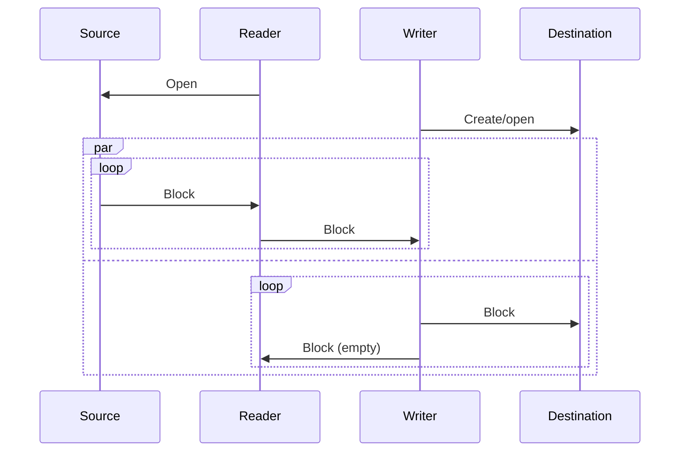
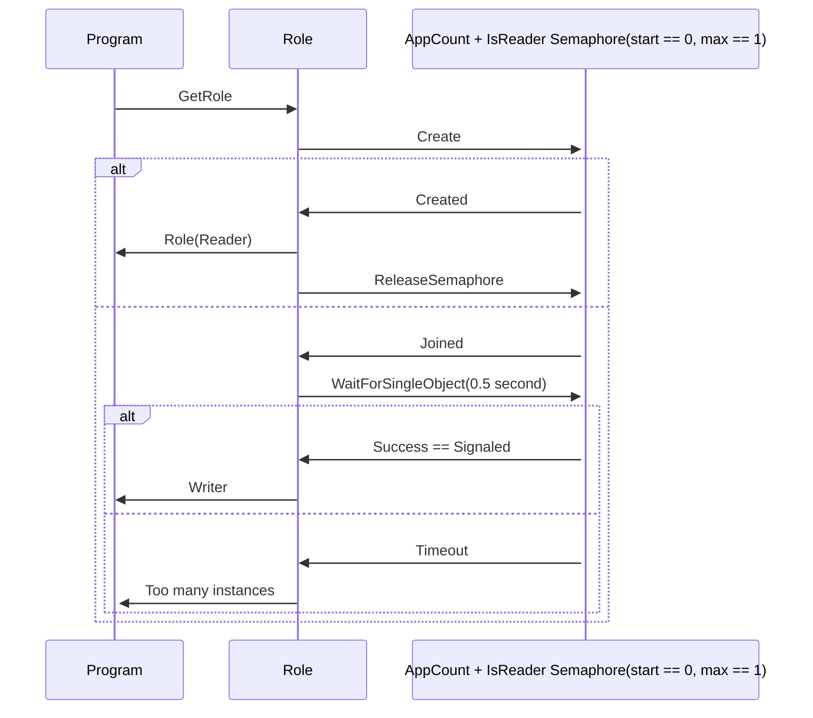
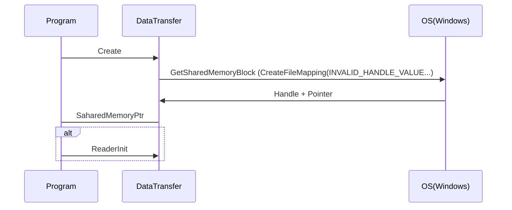
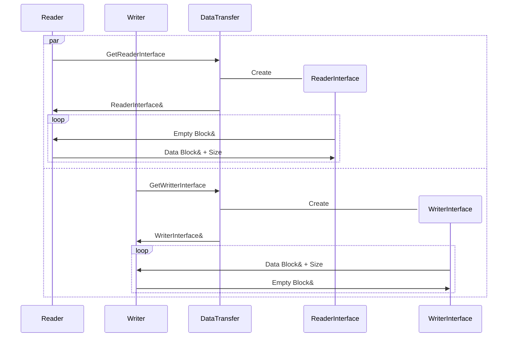

# Multiprocess communication

Let's use one semaphore for both: Decidnig role and synchronizing shared memory creation.
Let's prefer our API to not contein OS dependent object (like semaphore)

## High level Inter-process communication

Notes: Reader amd writter are synchronized by semaphores. It's shown on later diagram.

## Decide process role

## Create shared memory object

## Do copy

## Notes

Shared memory in Windows: https://learn.microsoft.com/en-us/windows/win32/memory/creating-named-shared-memory

Using semaphores in WIndows: https://learn.microsoft.com/en-us/windows/win32/sync/using-semaphore-objects?redirectedfrom=MSDN