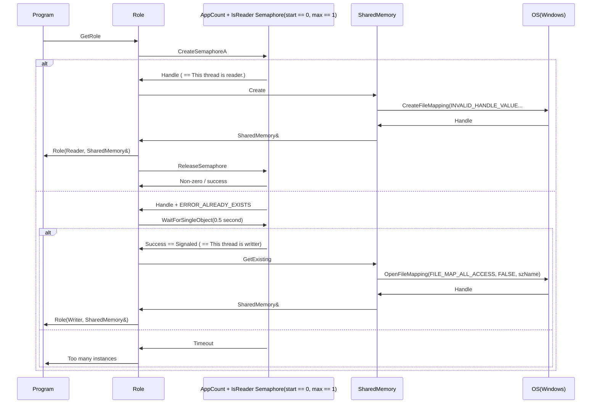
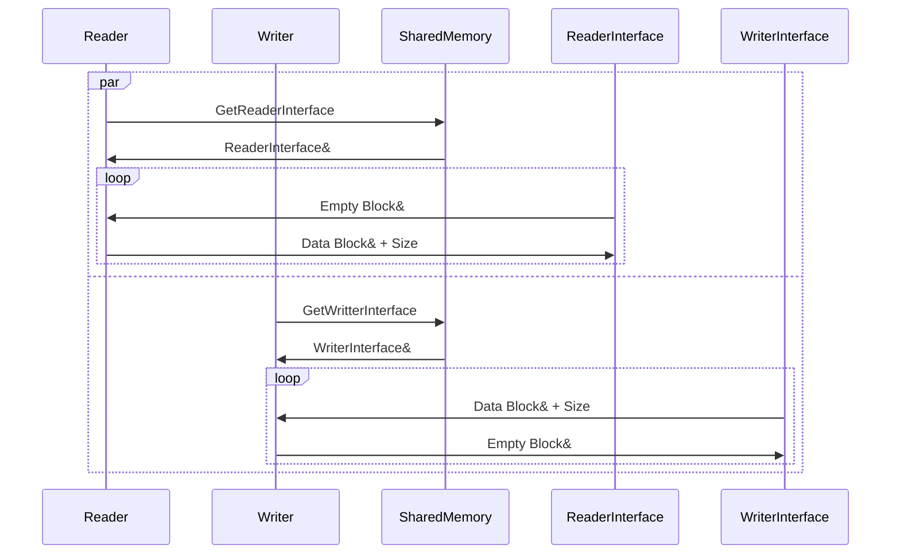

# Multiprocess communication

Let's use one semaphore for both: Decidnig role and synchronizing shared memory creation.
Let's prefer our API to not contein OS dependent object (like semaphore)

## Decide process role

Advantages: Clean interface for program.

Disadvantages: Role knows SharedMemory.

Maybe alternative: Role return OS-agnostic semaphore abstractions and program to give it to shared memory constructor together with role.

## Do copy

## Notes

Shared memory in Windows: https://learn.microsoft.com/en-us/windows/win32/memory/creating-named-shared-memory

Using semaphores in WIndows: https://learn.microsoft.com/en-us/windows/win32/sync/using-semaphore-objects?redirectedfrom=MSDN