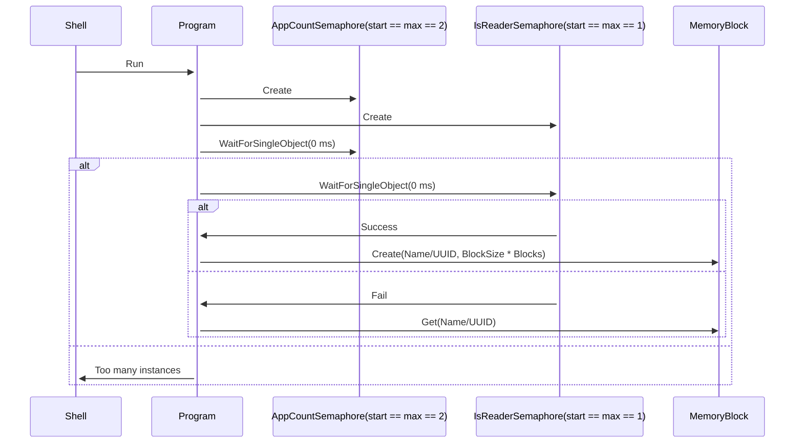

# Multiprocess communication

```mermaid
sequenceDiagram
    participant Shell
    participant Program
    participant AppCount as AppCountSemaphore(start == max == 2)
    participant IsReader as IsReaderSemaphore(start == max == 1)
    participant MemoryBlock
    activate AppCount
    activate IsReader
    Shell ->>+ Program: Run
    Program ->>+ AppCount: Create
    Program ->>+ IsReader: Create
    Program ->> AppCount: WaitForSingleObject(0 ms) 
    alt
        Program ->> IsReader: WaitForSingleObject(0 ms)
        alt
            IsReader ->> Program: Success
            Program ->> MemoryBlock: Create(Name/UUID, BlockSize * Blocks)
        else
            IsReader ->> Program: Fail
            Program ->> MemoryBlock: Get(Name/UUID)
        end
    else
        Program ->>+ Shell : Too many instances
    end
    

```
